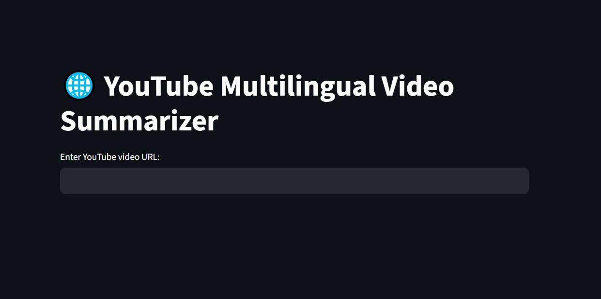
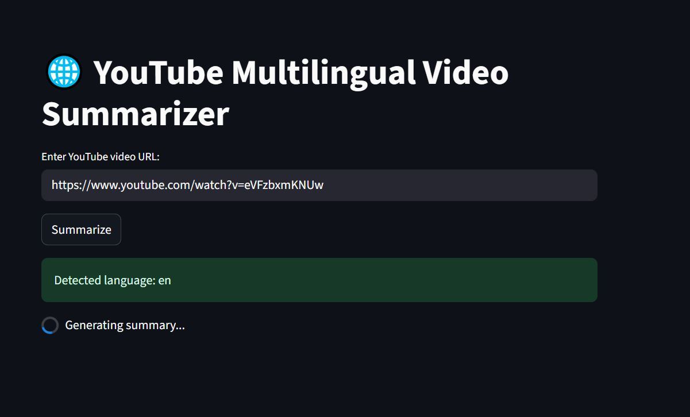
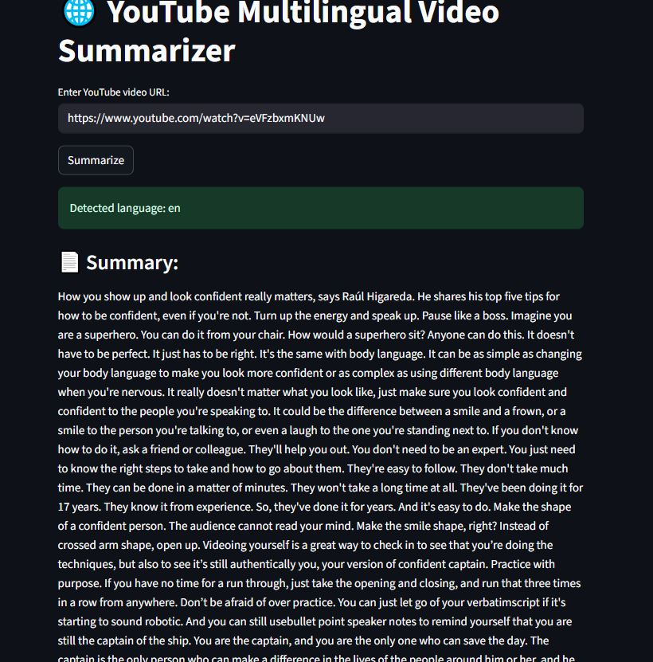

# Polyglot_Summarizer
A Streamlit-based web app that takes a YouTube video URL, fetches its transcript, and detcts the spoken language. If the transcript is in any language other than English, it is first translated into English using a multilingual translation model. The translated  text is then sent to a large language model (LLM) for summarization.
Since transcripts can be long, the text is tokenized in chunks.
🌍 It can summarize any YouTube video in any language you name!

📌Models usd:
facebook/bart-large-cnn  --> summarization
facebook/nllb-200-distilled-600M --> translation 

🔧 Technologies Used
- Python
- Streamlit
- Hugging Face Transformers (`pipeline`, `AutoTokenizer`)
- YouTube Transcript API
- langdetect (for language detection)

🚀 Demo:
https://polyglotsummarizer-nqtappohptd7vjfvzryc9fa.streamlit.app/

🖼️ App Interface

